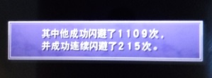
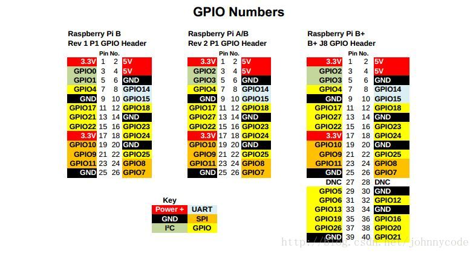
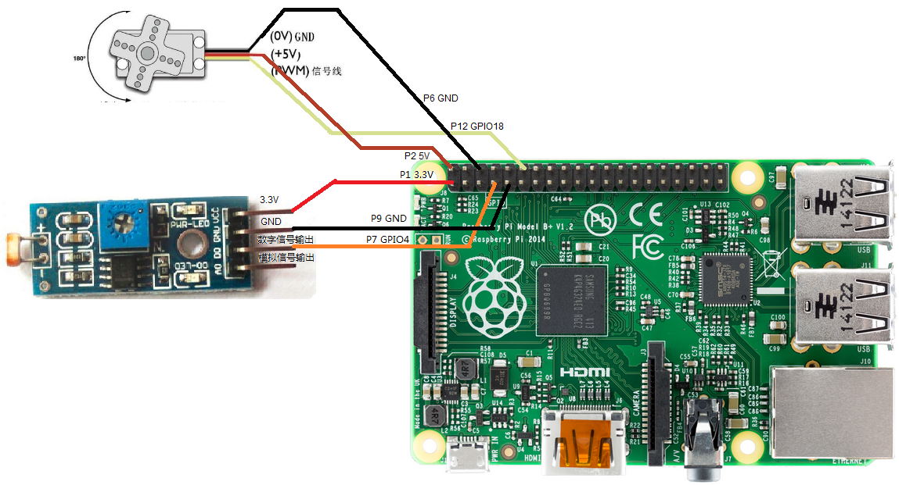

# 最终幻想 X 200 次避雷自动化

此项目基于树莓派硬件自动化，参考自文章：
“利用树莓派，光敏电阻和小型舵机实现自动获取《最终幻想 X HD 重制版》连续避雷 200 次奖杯”。

`run.py` 读取光敏电阻传感器，并驱动小型舵机在检测到闪电后按下 PSV 屏幕上的 O 键。

英文版请见 [README.md](README.md)。

## 概述

《最终幻想 X HD 重制版》的 200 次连续避雷挑战需要极快且稳定的反应速度。本项目使用树莓派、光敏电阻（LDR）传感器和小型舵机来自动检测闪电并按下按钮。

## 硬件

- 支持 GPIO 的树莓派
- 带模拟输出的光敏电阻（LDR）或光传感器模块
- 小型舵机
- 面包板或连线
- 树莓派和舵机的电源

## 接线

硬件接线按文章实现：

- `GPIO 4` 用于光传感器输入
- `GPIO 18` 用于舵机 PWM 输出

光传感器通过 GPIO 引脚检测闪电时的电平变化。
舵机信号线连接到支持 PWM 的 `GPIO 18`。

### 图片参考

成就截图：



电路连接图：



树莓派 GPIO 引脚图：



## 软件

主程序为 `run.py`，其行为如下：

- 设置 GPIO 模式为 `GPIO.BCM`
- 在 `servoPin = 18` 上初始化舵机
- 在 `lightPin = 4` 上准备光传感器
- 不断读取传感器值
- 当光传感器读取到 `GPIO.LOW` 时，执行快速舵机动作序列

脚本中的舵机动作序列为：

- 旋转到角度 30
- 等待 0.1 秒
- 旋转到角度 60
- 等待 0.1 秒
- 旋转回角度 30
- 等待 0.1 秒

该序列用于物理按下 O 键并快速释放。

## 工作原理

1. 光传感器监测 PSV 屏幕上的闪电。
2. 当闪电使光传感器输出发生变化时，树莓派检测到 `GPIO 4` 的低电平。
3. 舵机由 `GPIO 18` 的 PWM 信号驱动。
4. 舵机移动一个短脉冲来敲击按钮，然后回到初始位置。
5. 脚本记录次数并持续运行，直到手动停止。

## 注意事项

- 舵机角度需要根据实际舵机和按键结构调节。
- 如果光传感器模块没有内置 ADC，需要增加 ADC 电路或使用兼容传感器。
- 确保舵机电源稳定。如舵机电流较大，请使用单独电源或增加电阻。

## 运行

在安装了 GPIO 库的树莓派上运行：

```bash
python run.py
```

按 `Ctrl+C` 停止脚本。

## 参考

CNBlogs:
https://www.cnblogs.com/wpf_gd/articles/4700789.html

文章展示了使用树莓派自动化《最终幻想 X 200 次避雷奖杯》的完整思路、硬件搭建和示例代码。
